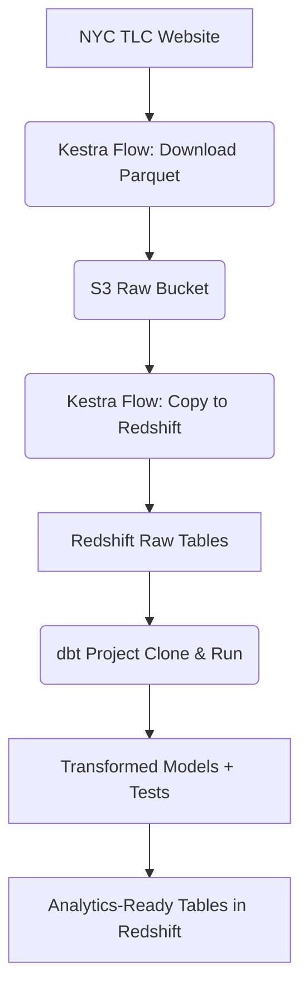

# NYC Taxi Data Pipeline


## Project Overview

This projects implements an **end-to-end data pipeline** for ingesting, storing, and transforming NYC Yellow and Green Taxi trip data using modern data engineering tools and AWS cloud services.

### Key Components

- **Data Ingestion**: Kestra flows to download NYC TLC trip data (Yellow & Green)
- **Cloud Storage**: Upload raw `.csv` or `.parquet` files to **Amazon S3**
- **Data Warehouse**: Load data into **Amazon Redshift**
- **Transformation**: **dbt** models for cleaning, aggregating, and creating analytics-ready tables
- **Infrastructure as Code**: **Terraform** to provision all AWS resources
- **Testing**: Comprehensive **dbt tests** for data quality and integrity

## Tech Stack

| Layer           | Technology                                      |
|-----------------|-------------------------------------------------|
| **Orchestration** | [Kestra](https://kestra.io)                     |
| **Transformation** | [dbt Cloud/Core](https://www.getdbt.com)       |
| **Infrastructure** | Terraform                                      |
| **Storage**       | Amazon S3                                      |
| **Warehouse**     | Amazon Redshift                                |
| **Source Data**   | [NYC TLC Trip Record Data](https://www.nyc.gov/site/tlc/about/tlc-trip-record-data.page) |

## Data Flow



## Project Structure

```bash
taxi-nyc-dbt/
├── kestra/
│   ├── docker/                           # Docker environment for running Kestra locally
│   │   └── docker-compose.yml            # Defines Kestra services (Kestra, PostgreSQL, etc.)
│   │
│   └── flows/                            # Kestra workflows for orchestration
│       ├── redshift_taxi_scheduled.yaml  # Extracts and loads taxi data into S3 and Redshift
│       └── dbt_redshift.yaml             # Clones the repo and executes dbt transformations
│
├── terraform/                            # Infrastructure as Code (IaC) definitions
│   ├── main.tf                           # AWS infrastructure definitions
│   ├── variables.tf                      # Terraform variable definitions
│   └── outputs.tf                        # Terraform outputs
│
├── taxi_dbt/                                  # dbt project for transformations, tests, and analysis
│   ├── models/
│   │   ├── staging/                      # Staging models (raw → cleaned)
│   │   └── marts/                        # Fact and dimension models for analytics
│   ├── tests/                            # Custom dbt tests for data validation
│   ├── analyses/                         # SQL analyses and reports
│   ├── macros/                           # Custom dbt macros for reusable logic
│   ├── seeds/                            # Optional static data (if any)
│   ├── snapshots/                        # Historical snapshots (if used)
│   └── dbt_project.yml                   # dbt project configuration
│
├── .gitignore                            # Git ignore file to exclude unnecessary files
└── README.md                             # Project documentation
```

## ⚙️ Setup & Deployment

### Prerequisites

- AWS Account with appropriate permissions
- AWS CLI configured with credentials
- Terraform installed (v1.0+)
- Kestra instance (local or cloud)
- dbt Core or dbt Cloud
- dbt-redshift adapter

## 1. Clone the Repository

```bash
git clone https://github.com/Munjogu123/taxi-nyc-dbt.git
cd taxi-nyc-dbt
```

## 2. Configure AWS Infrastructure

```bash
cd terraform

# Initialize Terraform
terraform init

# Review the planned changes
terraform plan

# Apply the infrastructure
terraform apply
```

This creates:

- S3 bucket for raw data storage
- Redshift namespace and workgroup
- IAM roles and policies
- Security groups
- VPC configurations

## 3. Configure Kestra

Start Kestra using Docker:

```bash
# navigate to where the docker-compose file is
cd kestra/docker

# start the container
docker compose up -d
```

1. Access the Kestra UI at <http://localhost:8080>
2. Import flows from `kestra/flows/` into your Kestra namespace
3. Update the flow configurations with your AWS credentials and resource identifiers

Add the environment variables in the KV store in Kestra UI.

## 4. Set Up dbt

```bash
cd dbt_project

# Install dependencies
pip install dbt-redshift

# Configure your profiles.yml with Redshift connection details
# Test the connection
dbt debug
```

## 🔄 Pipeline Workflow

### Data Extraction & Loading Flow

Once you have added the flows in kestra, you can move to the triggers section where you can execute a backfill to download data. In my project I used data from 2021, so I scheduled my trigger from 1st January to 30th June (6 months). This will download the data for all the 6 months (it could be longer, say, 1 year) and load them to the s3 bucket. For clarity this is the file that performs this operation: `kestra/flows/redshift_taxi_scheduled.yaml`

This kestra flow performs the following steps:

1. Download Yellow/Green Taxi Data (depending on the taxi you choose)
2. Upload to S3
3. Load to Redshift

### dbt Transformation Flow

You will then execute the flow defined in the `kestra/flows/dbt_redshift.yaml`.

This dbt flow executes:

1. **Clone Repository:** Clones this GitHub repository to access the dbt project
2. **Run Models:** Executes dbt transformation models in dependency order
3. **Test Data Quality:** Runs dbt tests to ensure data integrity

## Tests

Data quality tests include:

- **Generic Tests:** Not null, unique, accepted values, relationships
- **Custom Tests:** Business logic validation
- **Schema Tests:** Column presence and type validation

The flow runs the tests on execution but if you want to run the tests manually on your terminal, you can run them with:

```bash
# Run all tests
dbt test

# Run test for a particular model
dbt test --select <model_name>
```

## Test Coverage

The project includes tests for:

- Data completeness (null checks)
- Data uniqueness (primary keys)
- Referential integrity (foreign keys)
- Business rule validation

## Infrastructure as Code

All AWS resources are managed via Terraform:

### Managing Infrastructure

Once done with the project, navigate to the terminal and ensure you are in the terraform directory. Inside the terminal, you can delete the resources to avoid incurring additional costs from the resources when idle. To destroy them run:

```bash
terraform destroy
```

## 🤝 Contributing

Contributions are welcome! Please:

1. Fork the repo
2. Create a feature branch
3. Add tests
4. Open a PR with clear description
